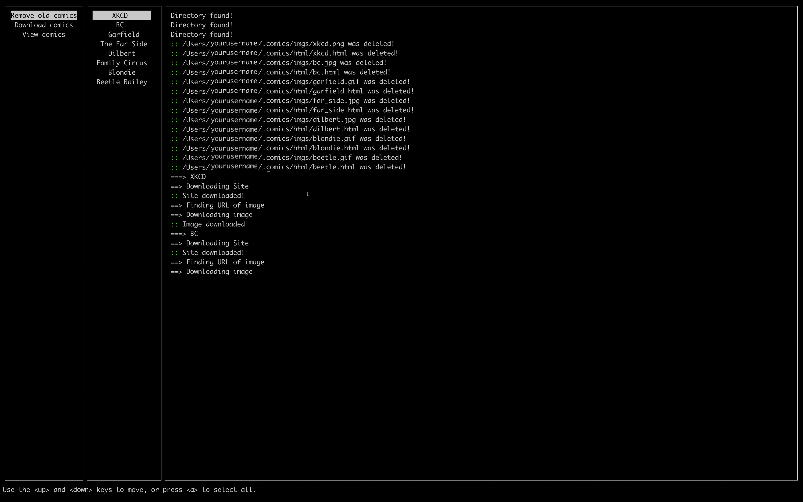

<!--
*** Thanks for checking out this README Template. If you have a suggestion that would
*** make this better, please fork the cmics and create a pull request or simply open
*** an issue with the tag "enhancement".
*** Thanks again! Now go create something AMAZING! :D
***
***
***
*** To avoid retyping too much info. Do a search and replace for the following:
*** Barthandelous01, cmics, twitter_handle, 
-->


<!-- PROJECT SHIELDS -->
<!--
*** I'm using markdown "reference style" links for readability.
*** Reference links are enclosed in brackets [ ] instead of parentheses ( ).
*** See the bottom of this document for the declaration of the reference variables
*** for contributors-url, forks-url, etc. This is an optional, concise syntax you may use.
*** https://www.markdownguide.org/basic-syntax/#reference-style-links
-->

<!-- PROJECT LOGO -->
<br />
<p align="center">
  <a href="https://github.com/Barthandelous01/cmics">
    
  </a>

  <p align="center">
    The C based comics downloader
    <br />
    <a href="https://github.com/Barthandelous01/cmics"><strong>Explore the docs »</strong></a>
    <br />
    <br />
    <a href="https://github.com/Barthandelous01/cmics/issues">Submit A Bug</a>
    ·
    <a href="https://github.com/Barthandelous01/cmics/issues">Request Feature</a>
  </p>
</p>


<!-- TABLE OF CONTENTS -->
## Table of Contents

* [About the Project](#about-the-project)
  * [Built With](#built-with)
* [Getting Started](#getting-started)
  * [Prerequisites](#prerequisites)
  * [Installation](#installation)
* [Usage](#usage)
* [Roadmap](#roadmap)
* [Contributing](#contributing)
* [License](#license)


<!-- ABOUT THE PROJECT -->
## About The Project




### Built With

* [gnu99-C](https://www.ansi.org/)
* [ncurses](https://invisible-island.net/ncurses/)
* [libcurl](https://curl.haxx.se/libcurl/)
* SQLite
* GNU Autotools


<!-- GETTING STARTED -->
## Getting Started

To get a local copy up and running follow these simple steps.

### Prerequisites

To install `cmics`, only a few dependencies are required. Get the following packages with `pip` and your package manager of choice.
* pip
```sh
pip3 install -r requirements.txt
```
* Package manager (Debian/Ubuntu example)
```sh
sudo apt-get install libncurses5-dev libncursesw5-dev 
sudo apt-get install libcurl4-gnutls-dev
```

### Installation
`cmics` is maintained using the GNU Autotools. To install, clone and make the build system yourself, or download a tarball, unzip it, and follow the ritual:
```sh
./configure
make
sudo make install
```
**WARNING:** If you want to install `cmics` somewhere else, that's totally fine. However, modify `src/imgs.c` so that the path of the installed `img` script is correct. If this is ommitted, the comics will download and cache correctly, but they *will not* display properly.

<!-- USAGE EXAMPLES -->
## Usage

Cmics is used for aggregating some of the geekier comics that many members of the programming community enjoy. To automate downloading all of the comics, run `echo -n 'aa' | cmics`. the `-n` is not required, but reccomended if you want to study the results.


<!-- ROADMAP -->
## Roadmap

Some things I intend to add one day are:
 * Another comic (or two). This is limited by keeping the GUI useable for people with small terminals, however.
 * A more sophisticated image display mechanism than the `img` script.

## Bugs
There are no currently known bugs in `cmics`. If you find a bug, please open an issue on GitHub!

<!-- CONTRIBUTING -->
## Contributing

Contributions are what make the open source community such an amazing place to be learn, inspire, and create. Any contributions you make are **greatly appreciated**.

1. Fork the Project
2. Create your Feature Branch (`git checkout -b feature/AmazingFeature`)
3. Commit your Changes (`git commit -m 'Add some AmazingFeature'`)
4. Push to the Branch (`git push origin feature/AmazingFeature`)
5. Open a Pull Request


<!-- LICENSE -->
## License

Distributed under the 3-part BSD License. See `LICENSE` for more information.
